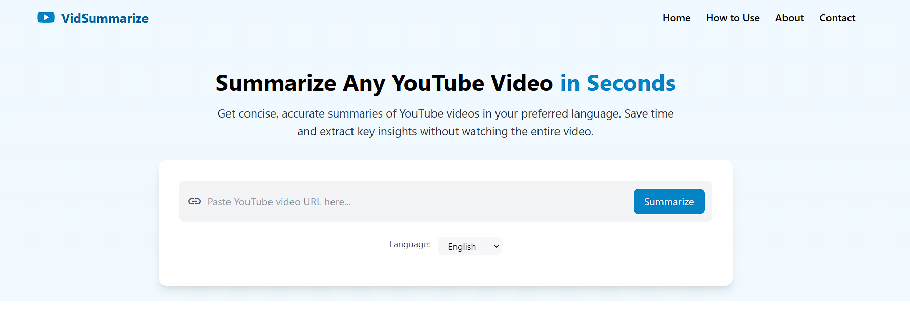
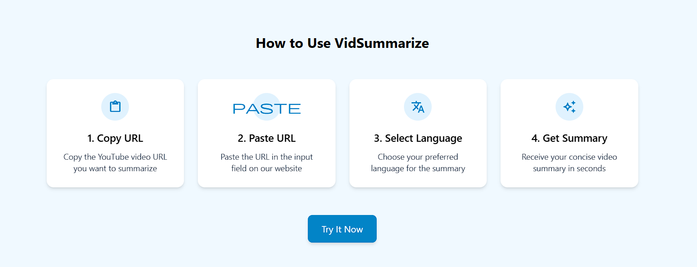
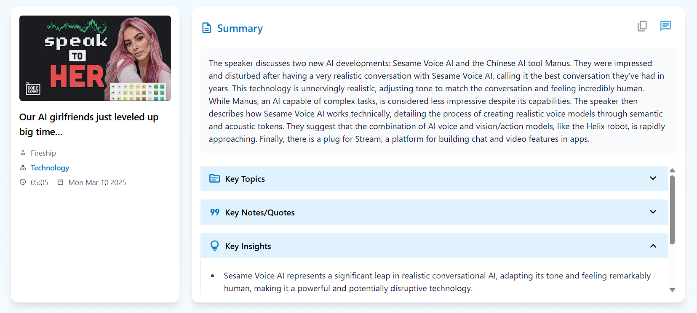
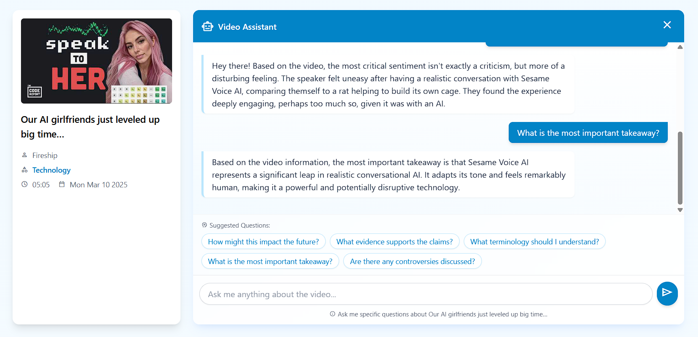

# VidSummarize

VidSummarize is a web application that provides concise summaries of YouTube videos. It extracts key topics, quotes, and insights to help users quickly understand video content without watching the entire video.

## Screenshots

### Home Page

*The main page where users can paste YouTube video URLs and select their preferred language for summaries.*

### How to Use

*Step-by-step instructions for using the VidSummarize application.*

### Summary View

*Displays the generated summary along with key topics, quotes, and insights extracted from the video.*

### Video Assistant

*Interactive assistant that answers questions about the video content based on the generated summary.*

## Features

- Extract YouTube video metadata (title, channel, duration, etc.)
- Generate video transcripts using Whisper
- Create AI-powered summaries using Google's Gemini API
- Extract key topics, quotes, and insights
- Clean, modern UI built with React and Tailwind CSS

## Usage

1. Paste a YouTube video URL in the input field
2. Click the "Summarize" button
3. Wait for the application to process the video (this may take a few minutes for longer videos)
4. View the generated summary along with key topics, quotes, and insights

## Technologies Used

- **Frontend**: React, Tailwind CSS, Vite
- **Backend**: Flask, Whisper (OpenAI), Gemini API
- **Tools**: yt-dlp (YouTube video downloader), FFmpeg

## License

MIT 
